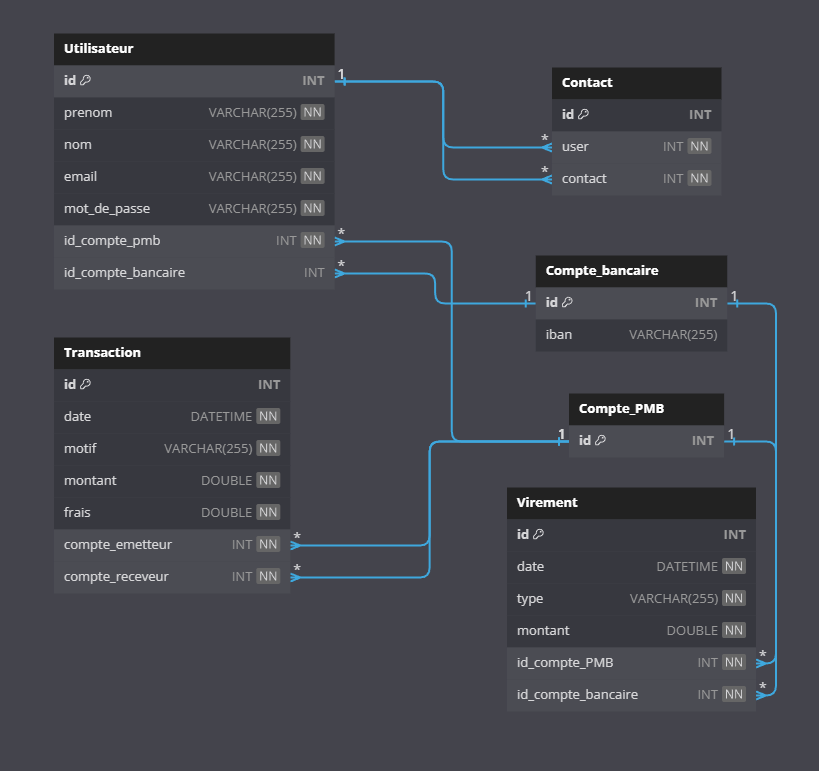
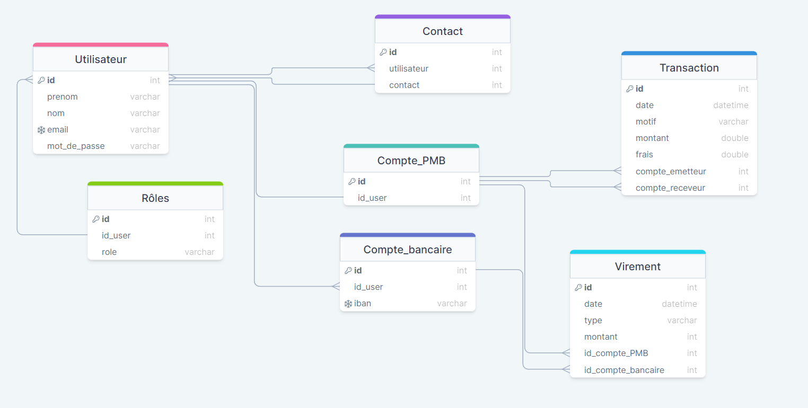

# Projet 6 - PayMyBuddy

> **Projet OpenClassrooms** : _Concevez une application web Java de A à Z_

Le but de cette société est de créer une solution de paiement entre amis. L'idée est de permettre à des personnes qui se connaissent de s'envoyer de l'argent entre elles. Les utilisateurs de l'application PayMyBuddy peuvent échanger de l'argent avec leurs amis. Pour cela, ils peuvent créditer leur compte en ligne par carte bancaire ou par virement. Ils peuvent ensuite effectuer des opérations de transfert d'argent avec leurs amis. L'application prend une commission sur chaque transaction.

## Objectifs

- Concevoir l'architecture technique d'une application en utilisant des diagrammes UML.
- Construire une application web Java en appliquant le pattern repository.
- Implémenter un schéma de données dans une base de données relationnelle.
- Réaliser une interface web simple en respectant des maquettes

## Technologies utilisées
- MySQL
- Spring Security
- Thymeleaf
- Bootstrap
- Spring Data JPA

---
## Ressources

### Diagramme de classe UML


### Modèle conceptuel de données


### Script SQL
*Le script est également disponible [ici](src/main/resources/schema.sql) au format `.sql`.*

```MySQL
# Désactivation la vérification des contraintes
SET FOREIGN_KEY_CHECKS = 0;

# Suppression des tables déjà existantes
DROP TABLE IF EXISTS `Utilisateur`;
DROP TABLE IF EXISTS `Contact`;
DROP TABLE IF EXISTS `Compte_PMB`;
DROP TABLE IF EXISTS `Compte_bancaire`;
DROP TABLE IF EXISTS `Transaction`;
DROP TABLE IF EXISTS `Virement`;

# Création des différentes tables
CREATE TABLE `Utilisateur`
(
    `id`                 INT          NOT NULL AUTO_INCREMENT PRIMARY KEY,
    `prenom`             VARCHAR(255) NOT NULL,
    `nom`                VARCHAR(255) NOT NULL,
    `email`              VARCHAR(255) NOT NULL,
    `mot_de_passe`       VARCHAR(255) NOT NULL,
    `id_compte_pmb`      INT          NOT NULL,
    `id_compte_bancaire` INT          NULL
);

CREATE TABLE `Contact`
(
    `id`      INT NOT NULL AUTO_INCREMENT PRIMARY KEY,
    `user`    INT NOT NULL,
    `contact` INT NOT NULL
);

CREATE TABLE `Compte_PMB`
(
    `id` INT NOT NULL AUTO_INCREMENT PRIMARY KEY
);

CREATE TABLE `Compte_bancaire`
(
    `id`   INT NOT NULL AUTO_INCREMENT PRIMARY KEY,
    `iban` VARCHAR(255)
);

CREATE TABLE `Transaction`
(
    `id`              INT          NOT NULL AUTO_INCREMENT PRIMARY KEY,
    `date`            DATETIME     NOT NULL,
    `motif`           VARCHAR(255) NOT NULL,
    `montant`         DOUBLE       NOT NULL,
    `frais`           DOUBLE       NOT NULL,
    `compte_emetteur` INT          NOT NULL,
    `compte_receveur` INT          NOT NULL
);

CREATE TABLE `Virement`
(
    `id`                 INT          NOT NULL AUTO_INCREMENT PRIMARY KEY,
    `date`               DATETIME     NOT NULL,
    `type`               VARCHAR(255) NOT NULL,
    `montant`            DOUBLE       NOT NULL,
    `id_compte_PMB`      INT          NOT NULL,
    `id_compte_bancaire` INT          NOT NULL
);

# Création des contraintes
ALTER TABLE `Utilisateur`
    ADD UNIQUE `utilisateur_email_unique` (`email`);
ALTER TABLE `Contact`
    ADD CONSTRAINT `contact_contact_foreign` FOREIGN KEY (`contact`) REFERENCES `Utilisateur` (`id`);
ALTER TABLE `Contact`
    ADD CONSTRAINT `contact_utilisateur_foreign` FOREIGN KEY (`user`) REFERENCES `Utilisateur` (`id`);
ALTER TABLE `Utilisateur`
    ADD CONSTRAINT `utilisateur_compte_pmb_id_compte_pmb_foreign` FOREIGN KEY (`id_compte_pmb`) REFERENCES `Compte_PMB` (`id`);
ALTER TABLE `Utilisateur`
    ADD CONSTRAINT `utilisateur_compte_bancaire_id_compte_bancaire_foreign` FOREIGN KEY (`id_compte_bancaire`) REFERENCES `Compte_bancaire` (`id`);
ALTER TABLE `Compte_bancaire`
    ADD UNIQUE `compte_bancaire_iban_unique` (`iban`);
ALTER TABLE `Transaction`
    ADD CONSTRAINT `transaction_compte_emetteur_foreign` FOREIGN KEY (`compte_emetteur`) REFERENCES `Compte_PMB` (`id`);
ALTER TABLE `Transaction`
    ADD CONSTRAINT `transaction_compte_receveur_foreign` FOREIGN KEY (`compte_receveur`) REFERENCES `Compte_PMB` (`id`);
ALTER TABLE `Virement`
    ADD CONSTRAINT `virement_id_compte_bancaire_foreign` FOREIGN KEY (`id_compte_bancaire`) REFERENCES `Compte_bancaire` (`id`);
ALTER TABLE `Virement`
    ADD CONSTRAINT `virement_id_compte_pmb_foreign` FOREIGN KEY (`id_compte_PMB`) REFERENCES `Compte_PMB` (`id`);

# Réactivation la vérification des contraintes
SET FOREIGN_KEY_CHECKS = 1;
```
